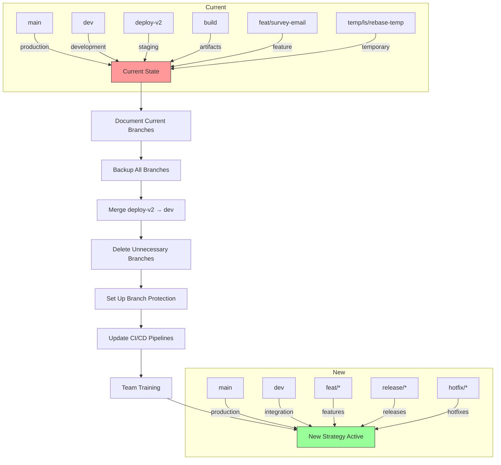
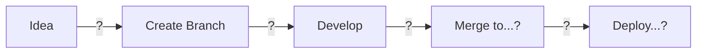
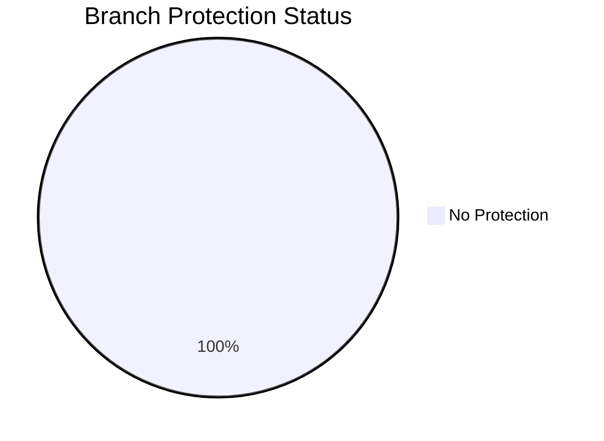
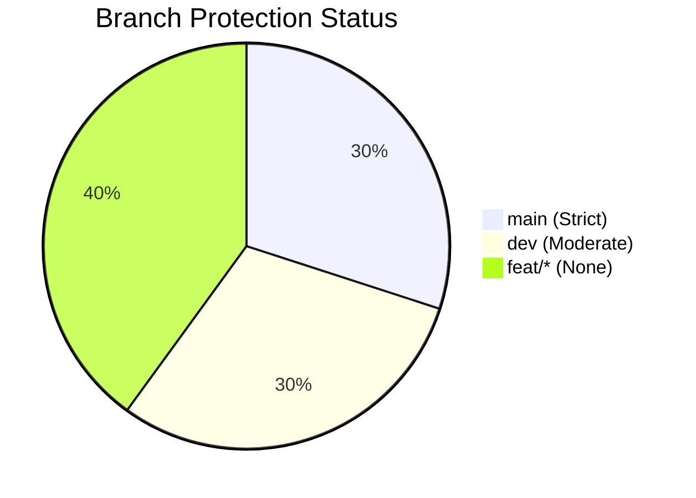
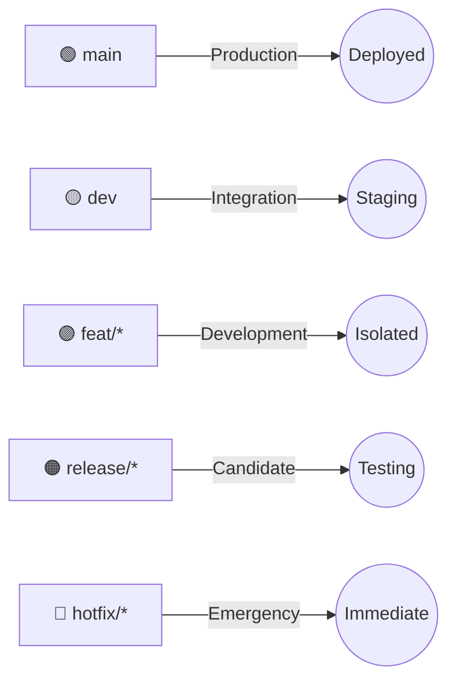
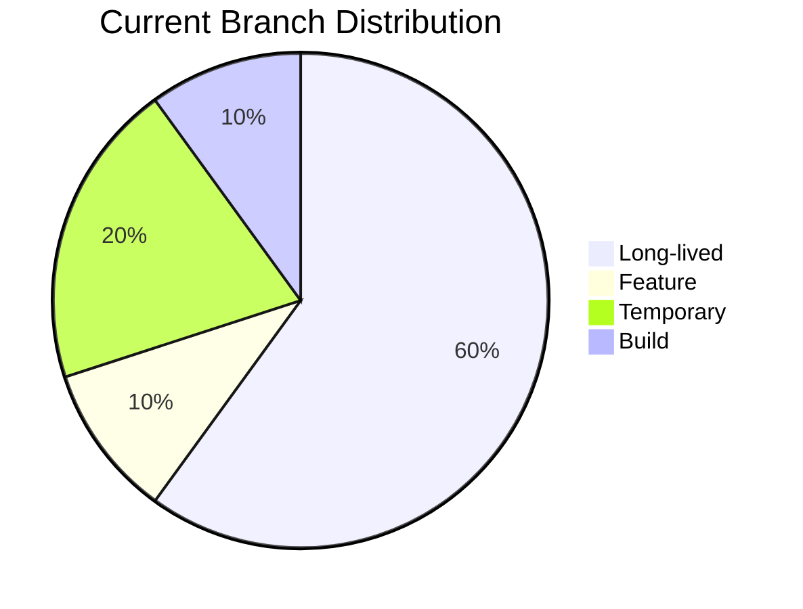
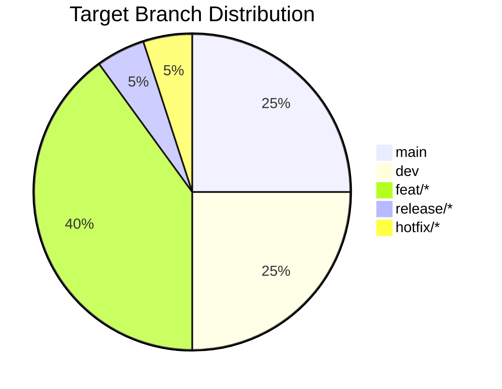
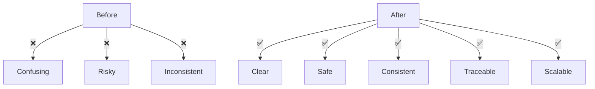
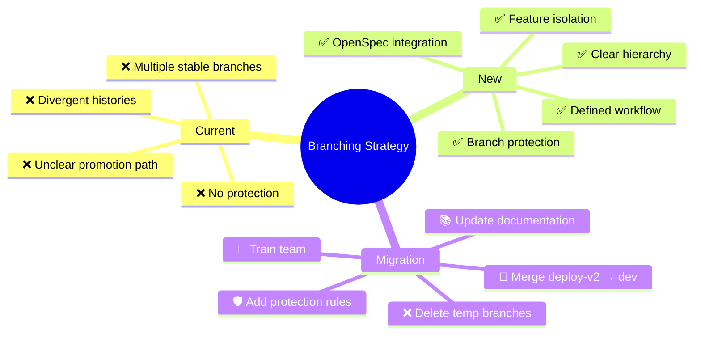

# Branching Strategy Visual Diagram

## Current vs Proposed Branching Strategy

### 📊 Current Branch Structure (Before Consolidation)


**Current Structure Issues:**
- ❌ Multiple "stable" branches with unclear purposes
- ❌ No clear promotion path (dev → deploy-v2 → main?)
- ❌ Temporary branches clutter the repository
- ❌ build branch stores artifacts (wrong place)
- ❌ Divergent histories between main and dev
- ❌ No branch protection

### 🎯 Proposed Branch Structure (After Consolidation)


**New Structure Benefits:**
- ✅ Clear hierarchy: main → dev → feat/*
- ✅ Defined promotion path: feat/* → dev → main
- ✅ Branch protection: main and dev protected
- ✅ Feature isolation: All development in feat/* branches
- ✅ Clean structure: No temporary or artifact branches
- ✅ Hotfix support: Emergency fixes from main

### 🔄 Migration Path



### 📋 Branch Lifecycle Comparison

#### Current Workflow


#### New Workflow

```mermaid
flowchart LR
    A[Idea] -->|openspec propose| B[feat/feature-name]
    B -->|develop| C[Complete Tasks]
    C -->|openspec archive| D[Merge to dev]
    D -->|integrate| E[dev branch]
    E -->|release process| F[release/vX.Y.Z]
    F -->|test| G[Merge to main]
    G -->|deploy| H[Production]
    H -->|tag| I[vX.Y.Z]
```


### 🛡️ Branch Protection Rules

#### Current State


#### New Strategy


### 🎨 Color-Coded Branch Types



### 📊 Branch Type Statistics

#### Current Repository


#### After Consolidation


### 🔗 OpenSpec Integration Flow

```mermaid
flowchart TD
    A[openspec propose "feature"] --> B[Suggest: feat/feature]
    B --> C[git checkout -b feat/feature dev]
    C --> D[Implement tasks]
    D --> E[openspec archive-change]
    E --> F[Create PR: feat/feature → dev]
    F --> G[Merge to dev]
    G --> H[Delete feat/feature]
    H --> I[Update main specs]
```

### 🚀 Workflow Benefits Visualization



### 📈 Expected Improvements

```mermaid
barChart
    title Branch Strategy Metrics
    x-axis [Current, After]
    y-axis "Score (1-10)"
    bar ["Clarity", 3, 9]
    bar ["Safety", 4, 8]
    bar ["Consistency", 2, 9]
    bar ["Traceability", 3, 9]
    bar ["Team Adoption", 5, 8]
```

### 🎯 Summary Visual

