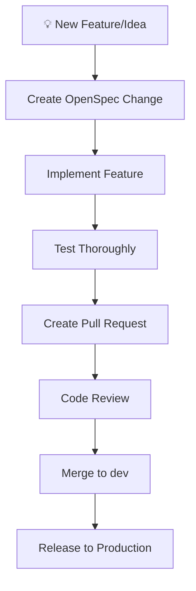
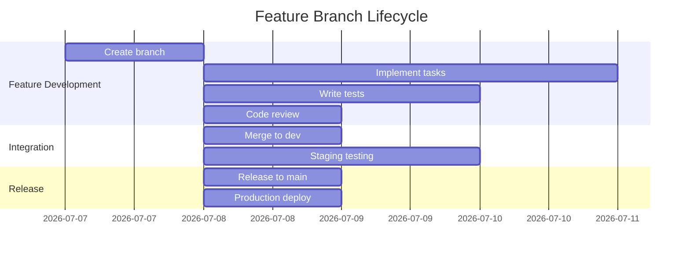
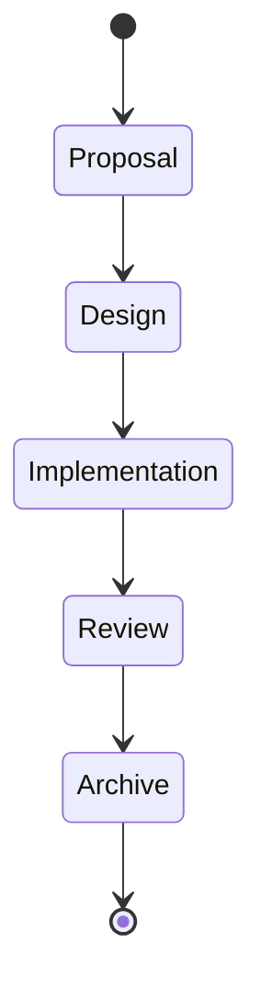

# Contributing to Voluntarios

Thank you for your interest in contributing to the Voluntarios project! This guide will help you get started with the development process.

## 📋 Table of Contents

- [Getting Started](#-getting-started)
- [Development Workflow](#-development-workflow)
- [Branching Strategy](#-branching-strategy)
- [Commit Guidelines](#-commit-guidelines)
- [Pull Request Process](#-pull-request-process)
- [Code Review](#-code-review)
- [Testing](#-testing)
- [Documentation](#-documentation)
- [OpenSpec Workflow](#-openspec-workflow)
- [Troubleshooting](#-troubleshooting)

## 🚀 Getting Started

### Prerequisites

- Git 2.30+
- Node.js 20+
- pnpm 8+
- Docker 20.10+ (for full stack development)
- OpenSpec CLI (installed globally)

### Setup

```bash
# Clone the repository
git clone https://github.com/Fundacion-Altius/voluntarios.git
cd voluntarios

# Install dependencies
cd voluntarios-back && pnpm install
cd ../voluntarios-front && pnpm install

# Set up environment variables
cp .env.example .env
# Edit .env with your configuration

# Start development servers
# Terminal 1: Backend
cd voluntarios-back && pnpm run dev

# Terminal 2: Frontend  
cd ../voluntarios-front && pnpm run dev
```

## 🔄 Development Workflow

Our development workflow follows a structured process:



### Step-by-Step Process

1. **Identify the requirement** - What needs to be built or fixed?
2. **Create OpenSpec change** - Define the scope and requirements
3. **Create feature branch** - Follow the branching strategy
4. **Implement the feature** - Write code and tests
5. **Test thoroughly** - Ensure all scenarios pass
6. **Create pull request** - Submit for code review
7. **Address feedback** - Make requested changes
8. **Merge to dev** - Feature becomes part of integration
9. **Monitor in staging** - Verify integration works
10. **Release to production** - Feature goes live

## 🌿 Branching Strategy

### Branch Creation

**Always create feature branches from `dev`, never from `main`:**

```bash
# 1. Create OpenSpec change first
openspec propose "your-feature-name"

# 2. Create feature branch from dev
git checkout dev
git pull origin dev
git checkout -b feat/your-feature-name

# 3. Push the branch
git push origin feat/your-feature-name
```

### Branch Naming Convention

| Type | Pattern | Example |
|------|---------|---------|
| Feature | `feat/<name>` | `feat/user-authentication` |
| Bugfix | `fix/<description>` | `fix/login-error` |
| Hotfix | `hotfix/<description>` | `hotfix/security-patch` |
| Release | `release/vX.Y.Z` | `release/v1.2.0` |

**❌ Avoid:**
- `feature/` prefix (use `feat/`)
- Branching from main
- Generic names like `dev`, `test`, `patch`

### Branch Lifecycle



## ✍️ Commit Guidelines

### Commit Message Format

```
<type>(<scope>): <description> [#task-id]
```

**Examples:**
```bash
# Good commit messages
git commit -m "feat(auth): implement JWT authentication [#TASK-15]"
git commit -m "fix(api): handle null values in survey submission [#TASK-23]"
git commit -m "chore(deps): update drizzle-orm to v0.30.0"
git commit -m "docs(readme): add contribution guidelines"
git commit -m "test(user): add validation tests for email format"
```

### Commit Types

| Type | Description | When to use |
|------|-------------|-------------|
| `feat` | New feature | Adding new functionality |
| `fix` | Bug fix | Fixing a bug |
| `chore` | Maintenance | Dependency updates, config changes |
| `docs` | Documentation | Adding/updating documentation |
| `test` | Tests | Adding or updating tests |
| `refactor` | Code refactoring | Restructuring existing code |
| `perf` | Performance | Performance improvements |
| `build` | Build system | Build configuration changes |
| `ci` | CI/CD | CI/CD pipeline changes |
| `revert` | Revert | Reverting a previous commit |

### Best Practices

✅ **Do:**
- Keep commits small and focused
- Reference OpenSpec task IDs
- Write clear, descriptive messages
- Commit often (atomic commits)
- Include relevant changes only

❌ **Don't:**
- Mix multiple features in one commit
- Use vague messages like "fix bug" or "update code"
- Commit broken code
- Include generated files
- Forget to add new files

## 📤 Pull Request Process

### Creating a Pull Request

1. **Ensure your feature branch is up to date:**
   ```bash
   git checkout feat/your-feature
   git pull origin dev  # Rebase on latest dev
   ```

2. **Push your branch:**
   ```bash
   git push origin feat/your-feature
   ```

3. **Create the PR:**
   - Target branch: `dev` (never `main`)
   - Title: Clear description of the change
   - Description: Reference OpenSpec change and tasks
   - Labels: Add appropriate labels

4. **Link to OpenSpec change:**
   ```markdown
   ## Description
   
   Implements OpenSpec change: `your-feature-name`
   
   Completes tasks:
   - [x] Task 1.1: Implement API endpoint
   - [x] Task 1.2: Add validation
   - [x] Task 1.3: Write tests
   
   ## Checklist
   - [x] All tasks completed
   - [x] Tests passing
   - [x] Documentation updated
   - [x] Code review ready
   ```

### Pull Request Requirements

- ✅ All OpenSpec tasks completed
- ✅ Tests passing (CI checks)
- ✅ Code review approval (1 for dev, 2 for main)
- ✅ No merge conflicts
- ✅ Up-to-date with target branch
- ✅ Clear description and context

## 👀 Code Review

### Review Process

1. **Self-review:** Check your own code before requesting review
2. **Request review:** Assign appropriate reviewers
3. **Address feedback:** Make requested changes
4. **Iterate:** Continue until approved
5. **Merge:** Once approved, merge the PR

### Review Checklist

**For Reviewers:**
- [ ] Code follows project conventions
- [ ] All tests pass
- [ ] No security vulnerabilities
- [ ] Performance considerations addressed
- [ ] Error handling is comprehensive
- [ ] Documentation is updated
- [ ] Changes match OpenSpec requirements

**For Authors:**
- [ ] Respond to all feedback
- [ ] Update PR description with changes
- [ ] Test all changes thoroughly
- [ ] Keep PR focused and small
- [ ] Be responsive to reviewer questions

### Common Review Feedback

| Issue | Solution |
|-------|----------|
| Missing tests | Add comprehensive test coverage |
| Large PR | Break into smaller PRs |
| Merge conflicts | Rebase on latest dev |
| Style issues | Follow ESLint/Prettier rules |
| Missing docs | Update README or relevant docs |
| Performance concerns | Optimize the implementation |

## 🧪 Testing

### Test Requirements

- **Unit tests:** For individual functions/modules
- **Integration tests:** For component interactions
- **E2E tests:** For user flows
- **Test coverage:** Minimum 80% required

### Running Tests

```bash
# Backend tests
cd voluntarios-back
pnpm test

# Frontend tests
cd voluntarios-front
pnpm test

# E2E tests
cd voluntarios-front
pnpm run test:e2e
```

### Test Structure

```
📁 tests/
├── unit/
│   ├── module1.test.ts
│   └── module2.test.ts
├── integration/
│   ├── api.test.ts
│   └── services.test.ts
└── e2e/
    ├── user-flows.spec.ts
    └── admin-flows.spec.ts
```

## 📚 Documentation

### Documentation Requirements

Every feature must include:
- **Code comments:** For complex logic
- **README updates:** For user-facing changes
- **API documentation:** For new endpoints
- **Architecture decisions:** In ADR format if significant

### Documentation Types

| Type | Location | Format |
|------|----------|--------|
| User docs | `/docs` | Markdown |
| API docs | OpenAPI | YAML |
| Code docs | Inline | JSDoc/TSDoc |
| ADRs | `/docs/adr` | Markdown |

## 📂 OpenSpec Workflow

### OpenSpec Commands

```bash
# Create a new change
openspec propose "feature-name"

# Check change status
openspec status --change "feature-name"

# Get implementation instructions
openspec instructions apply --change "feature-name"

# Archive completed change
openspec archive-change "feature-name"

# List all changes
openspec list
```

### OpenSpec Artifacts

Every change includes:
- `proposal.md` - Why and what
- `design.md` - How (for complex changes)
- `specs/` - Detailed requirements
- `tasks.md` - Implementation checklist

### OpenSpec Lifecycle



## ❓ Troubleshooting

### Common Issues

**Issue: Merge conflicts**
```bash
# Rebase your branch on latest dev
git checkout feat/your-feature
git pull --rebase origin dev
# Resolve conflicts, then force push
git push origin feat/your-feature --force-with-lease
```

**Issue: Failed CI checks**
```bash
# Check CI logs for specific errors
# Fix the issues locally
# Push the fixes
git commit -am "fix: address CI feedback"
git push origin feat/your-feature
```

**Issue: Branch protection rejection**
```bash
# Ensure you're targeting the right branch
# For feature branches: target dev
# For hotfixes: target main
# Get required approvals
```

**Issue: OpenSpec command not found**
```bash
# Install OpenSpec CLI
npm install -g @openspec/cli
# Or use npx
npx openspec <command>
```

### Getting Help

1. **Check documentation:** `README.md`, `CONTRIBUTING.md`
2. **Review examples:** Existing OpenSpec changes
3. **Ask team:** Slack/Teams channel
4. **Create issue:** GitHub issues for bugs
5. **Propose changes:** GitHub discussions for ideas

## 🎯 Best Practices

### Development
- ✅ Follow the branching strategy
- ✅ Create OpenSpec change before coding
- ✅ Write tests first (TDD approach)
- ✅ Keep PRs small and focused
- ✅ Update documentation with changes
- ✅ Clean up feature branches after merge

### Code Quality
- ✅ Follow ESLint/Prettier rules
- ✅ Use TypeScript types effectively
- ✅ Write self-documenting code
- ✅ Handle errors gracefully
- ✅ Optimize performance
- ✅ Secure sensitive data

### Collaboration
- ✅ Communicate early and often
- ✅ Be responsive to feedback
- ✅ Help review others' code
- ✅ Document decisions
- ✅ Share knowledge
- ✅ Be respectful and constructive

## 📞 Contact

- **Project Lead:** [Name/Contact]
- **Tech Lead:** [Name/Contact]
- **Slack Channel:** `#voluntarios-dev`
- **Email:** `team@fundacionaltius.org`

Thank you for contributing to Voluntarios! 🚀