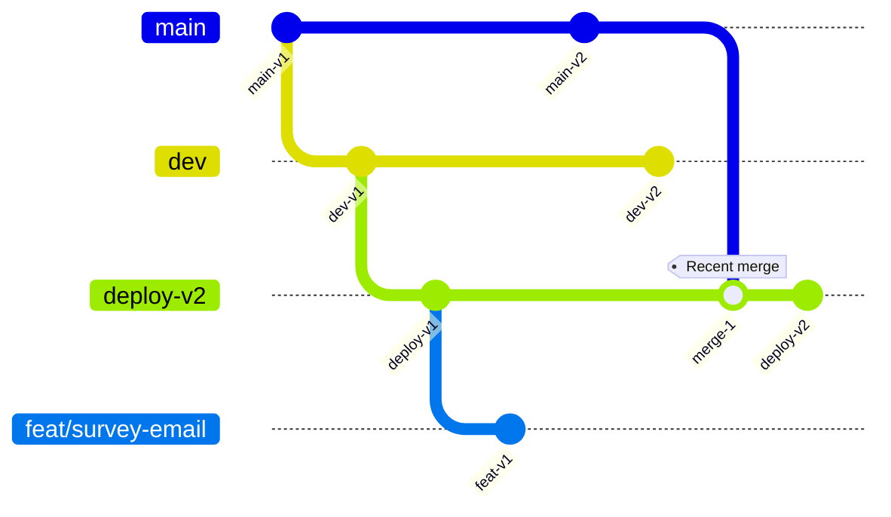
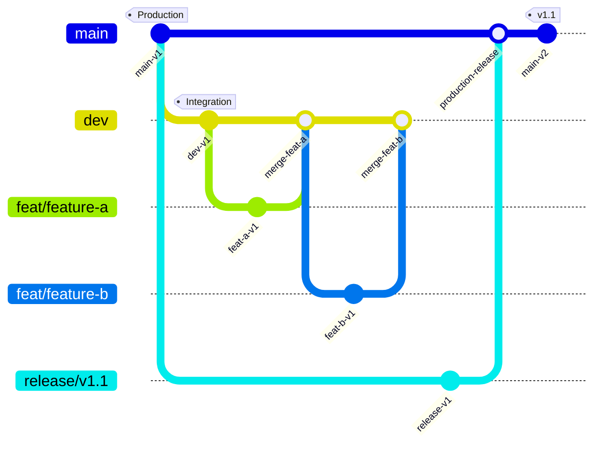

# Current Branch State Documentation

## Overview
This document captures the current state of all branches in the repository as of 2026-07-07, before implementing the new branching strategy.

## Branch Inventory

### Long-Lived Branches

#### `main` branch
- **Purpose:** Production code
- **Protection:** None currently
- **Current HEAD:** `0be66f9` (chore: stop tracking .env, add .env.example template)
- **Recent commits:**
  - `0be66f9` chore: stop tracking .env, add .env.example template
  - `1593bb6` feat: multiple changes across backend - controllers, DB, auth, tests, PDF generation
  - `06f1eb5` feat: add health check endpoint
  - `21d7ca2` docs: add comprehensive API documentation
  - `320db80` Merge pull request #1 from Fundacion-Altius/users
- **Status:** Stable production code, no recent activity
- **Exists in:** Both backend and frontend

#### `dev` branch
- **Purpose:** Active development
- **Protection:** None currently
- **Current HEAD:** `9e215f4` (docs: add current issues section)
- **Recent commits:**
  - `9e215f4` docs: add current issues section
  - `f65a61d` docs: update deployment info
  - `aa42206` docs: add branch status documentation
  - `fdac1ce` test: all tests passed
  - `178a6e1` test: all test passed
- **Status:** Active development with OAuth features, diverged from main
- **Exists in:** Both backend and frontend
- **Backend current branch:** ✅ (currently checked out)

#### `deploy-v2` branch
- **Purpose:** Deployment/staging with fixes
- **Protection:** None currently
- **Current HEAD:** `f2df0a0` (fix: centralize database connection and fix Supabase connectivity)
- **Recent commits:**
  - `f2df0a0` fix: centralize database connection and fix Supabase connectivity
  - `009ff11` fix: type error catch clause in surveyEmailScheduler
  - `a80457e` chore: add build/ to gitignore and remove from tracking
  - `06dcf4a` fix: use Supabase for Postgres and Docker Redis with persistence
  - `dae5c60` feat: complete Docker deployment setup for Render
- **Status:** Contains deployment-specific fixes (Docker, Supabase, health checks)
- **Exists in:** Both backend and frontend
- **Backend current branch:** ✅ (currently checked out)

#### `build` branch
- **Purpose:** Build artifacts (questionable)
- **Protection:** None currently
- **Status:** Appears to be outdated/abandoned
- **Recent activity:** None visible
- **Exists in:** Both backend and frontend
- **Recommendation:** Archive and delete (build artifacts don't belong in git)

### Feature Branches

#### `feat/survey-email` branch
- **Purpose:** Survey email functionality
- **Protection:** None currently
- **Current HEAD:** `363b732` (fix: load .env.staging for Mailpit SMTP in staging script)
- **Recent commits:**
  - `363b732` fix: load .env.staging for Mailpit SMTP in staging script
  - `0be66f9` chore: stop tracking .env, add .env.example template
  - `1593bb6` feat: multiple changes across backend - controllers, DB, auth, tests, PDF generation
- **Status:** Active feature branch, follows new naming convention
- **Exists in:** Both backend and frontend
- **Naming:** ✅ Correct (follows feat/* pattern)
- **Creation source:** Appears to be from main (needs verification)

### Temporary/Unknown Branches

#### `temp` branch
- **Purpose:** Unknown (likely temporary)
- **Protection:** None
- **Status:** Remote only, no local presence
- **Exists in:** Remote only
- **Recommendation:** Delete

#### `ls` branch
- **Purpose:** Unknown (possibly experimental)
- **Protection:** None
- **Status:** Backend only
- **Exists in:** Backend only
- **Recommendation:** Delete

#### `rebase-temp` branch
- **Purpose:** Rebase temporary
- **Protection:** None
- **Status:** Backend only
- **Exists in:** Backend only
- **Recommendation:** Delete

#### `dev-vercel` branch
- **Purpose:** Vercel deployment specific
- **Protection:** None
- **Status:** Backend only
- **Exists in:** Backend only
- **Recent commits:** Unknown (not in recent history)
- **Recommendation:** Evaluate for merge into dev or deletion

## Branch Relationships

### Backend Repository
```
main (0be66f9) ← Production
    ↓
dev (9e215f4) ← Active development (diverged)
    ↓
deploy-v2 (f2df0a0) ← Deployment fixes (recently merged with main)
    ↓
feat/survey-email (363b732) ← Feature branch

Other branches: build, temp, ls, rebase-temp, dev-vercel
```

### Frontend Repository
```
main (same as backend) ← Production
    ↓
dev (9e215f4) ← Active development (currently checked out)
    ↓
deploy-v2 (same as backend) ← Deployment fixes
    ↓
feat/survey-email (same as backend) ← Feature branch

Other branches: build, temp
```

## Divergence Analysis

### main vs dev Divergence
- **Backend:** Completely different commit histories
- **Frontend:** Completely different commit histories
- **Issue:** No clear promotion path from dev to main
- **Risk:** Features developed in dev may not make it to production

### deploy-v2 Relationships
- **Recent merge:** deploy-v2 was recently merged with main (commit 69102ff)
- **Current state:** deploy-v2 contains additional deployment-specific fixes
- **Purpose:** Appears to be the actual "staging" environment
- **Recommendation:** Merge into dev as part of consolidation

## Branch Protection Status

### Current Protection
- **main:** ❌ No protection
- **dev:** ❌ No protection
- **deploy-v2:** ❌ No protection
- **feat/*:** ❌ No protection
- **build:** ❌ No protection

### Recommended Protection (New Strategy)
- **main:** ✅ Strict protection (2 approvals, status checks)
- **dev:** ✅ Moderate protection (1 approval, status checks)
- **feat/*:** ❌ No protection (development freedom)

## Migration Path Analysis

### Branches to Keep
- ✅ `main` - Production branch
- ✅ `dev` - Becomes integration/staging branch
- ✅ `feat/survey-email` - Example of correct feature branch pattern

### Branches to Merge
- 🔄 `deploy-v2` → Merge into `dev` (preserve deployment fixes)

### Branches to Delete
- ❌ `build` - Build artifacts don't belong in git
- ❌ `temp` - Temporary branch, no longer needed
- ❌ `ls` - Unknown purpose, appears abandoned
- ❌ `rebase-temp` - Temporary rebase branch

### Branches to Evaluate
- ⚠️ `dev-vercel` - Backend only, evaluate for merge or deletion

## Current Workflow Issues

1. **Multiple "stable" branches:** main, dev, deploy-v2 all serve different purposes
2. **Unclear promotion path:** No defined workflow from dev → deploy-v2 → main
3. **Feature branch inconsistency:** Only some features use feat/* branches
4. **Divergence:** dev and main have completely different histories
5. **Deployment confusion:** deploy-v2 seems to be the actual staging environment
6. **No branch protection:** Critical branches can be modified directly

## Recommendations

1. **Immediate Actions:**
   - Merge deploy-v2 into dev to preserve deployment fixes
   - Delete temporary and abandoned branches
   - Set up branch protection for main and dev

2. **Migration Strategy:**
   - Adopt main → dev → feat/* hierarchy
   - Implement branch protection rules
   - Update CI/CD pipelines for new branch names
   - Train team on new workflow

3. **Long-term:**
   - Monitor branch lifecycle metrics
   - Conduct quarterly strategy reviews
   - Update documentation based on real-world usage

## Visual Representation

### Current State


### Target State
