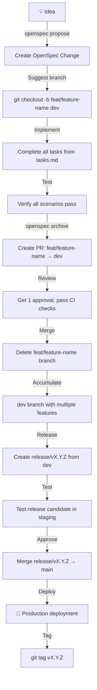

# Voluntarios Application

A full-stack application for managing volunteer contracts and surveys.

## Project Structure

This is a monorepo with two main packages:

- `voluntarios-back/` - Express + TypeScript backend (API server)
- `voluntarios-front/` - Next.js 14 frontend (web application)

## Docker Setup

### Prerequisites

- Docker Engine 20.10+
- Docker Compose v2+
- Node.js 20+ (for local development without Docker)

### Quick Start with Docker

1. **Build and start all services:**

```bash
docker-compose up --build
```

2. **Access the application:**

- Frontend: http://localhost:3000
- Backend API: http://localhost:3001
- API Docs: http://localhost:3001/api-docs
- Health Check: http://localhost:3001/api/health

### Services

The docker-compose setup includes:

- `frontend`: Next.js application (port 3000)
- `backend`: Express API server (port 3001)
- `postgres`: PostgreSQL database (port 5432)
- `redis`: Redis for job queue (port 6379)

### Development Workflow

1. **Hot reloading**: Source code is mounted as volumes, so changes are reflected immediately
2. **Environment variables**: Configured in docker-compose.yml
3. **Database persistence**: Postgres data is stored in a Docker volume

## Deployment Architecture

**Backend (Express API)** → Render.com (Docker Container)
**Frontend (Next.js)** → Vercel (Serverless)

## Backend Deployment to Render

### Prerequisites

- Render account (https://render.com)
- GitHub repository connected to Render
- PostgreSQL database (Render managed or external)
- Redis instance (Render managed or external)

### Deployment Steps

1. **Create a new Web Service on Render**
2. **Connect your GitHub repository**
3. **Configure build settings:**
   - **Build Command**: `docker build -f docker/render/Dockerfile.prod -t voluntarios-back .`
     *(Works with or without pnpm-lock.yaml)*
   - **Start Command**: `docker run -p 3001:3001 voluntarios-back`
4. **Set environment variables** (see `docker/render/render.env.example`)
5. **Configure health check:**
   - Path: `/api/health`
   - Port: 3001
   - Initial Delay: 10 seconds
   - Interval: 30 seconds

### Environment Variables

Edit the environment files in `docker/render/`:

```bash
# For staging
cp docker/render/.env.staging docker/render/.env.staging.backup
nano docker/render/.env.staging

# For production  
cp docker/render/.env.staging docker/render/.env.production
nano docker/render/.env.production
```

**Required variables to configure:**
- `DB_HOST`, `DB_USER`, `DB_PASSWORD`, `DB_NAME` - Your PostgreSQL database
- `REDIS_HOST` - Your Redis instance
- `SMTP_*` - Your email provider settings
- `JWT_SECRET` - Strong secret key for authentication
- `FRONTEND_URL` - Your frontend domain for CORS

These files are gitignored for security.

## Frontend Deployment to Vercel

The frontend deploys to Vercel (serverless) and connects to Render backend:

### Steps:

1. **Connect GitHub repository to Vercel**
2. **Set environment variable:**
   ```
   NEXT_PUBLIC_API_URL=https://your-render-backend.onrender.com
   ```
3. **Deploy** - Vercel handles the rest automatically

### Configuration:
- **Framework Preset**: Next.js
- **Build Command**: `pnpm run build`
- **Output Directory**: `.next`
- **Node.js Version**: 20.x

The frontend will automatically call the backend API at the configured URL.

## Local Development (Without Docker)

### Backend

```bash
cd voluntarios-back
pnpm install
pnpm run dev
```

### Frontend

```bash
cd voluntarios-front
pnpm install
pnpm run dev
```

## Architecture

```
┌───────────────────────────────────────────────────────┐
│                    Frontend (Vercel)                  │
│               Next.js 14 + React 18                   │
└───────────────────────┬───────────────────────────────┘
                        │
                        │ HTTP/HTTPS
                        ▼
┌───────────────────────────────────────────────────────┐
│                    Backend (Render)                   │
│               Express + TypeScript                    │
└───────────────────────┬───────────────────────────────┘
                        │
                        ├───────────────────────────────┐
                        │                               │
                        ▼                               ▼
┌─────────────────────────────────┐ ┌─────────────────────┐
│          PostgreSQL             │ │       Redis        │
│           Database              │ │    (Bull Queue)    │
└─────────────────────────────────┘ └─────────────────────┘
```

## Key Features

- **Contract Management**: Create and manage volunteer contracts
- **Survey System**: Collect feedback with custom surveys
- **Email Notifications**: Automated survey invitations
- **Authentication**: JWT-based authentication
- **Admin Dashboard**: Analytics and management interface

## Scripts

### Docker Commands

```bash
# Start all services
docker-compose up

# Start in detached mode
docker-compose up -d

# Stop all services
docker-compose down

# Rebuild and restart
docker-compose up --build

# View logs
docker-compose logs -f

# Clean up (remove volumes too)
docker-compose down -v
```

### Backend Commands

```bash
# Development mode
pnpm run dev

# Production build
pnpm run build

# Run tests
pnpm test

# Lint
pnpm run lint
```

### Frontend Commands

```bash
# Development mode
pnpm run dev

# Production build
pnpm run build

# Run tests
pnpm test
```

## Troubleshooting

### Docker Issues

- **Port conflicts**: Make sure ports 3000, 3001, 5432, and 6379 are available
- **Volume permissions**: If you get permission errors, try `docker-compose down -v` and restart
- **Build cache**: If builds fail, try `docker-compose build --no-cache`

### Database Issues

- **Connection refused**: Check that Postgres container is running
- **Authentication failed**: Verify database credentials in docker-compose.yml

### Networking Issues

- **Frontend can't reach backend**: Ensure frontend uses `http://backend:3001` as API URL
- **CORS errors**: Check CORS configuration in backend

## Git Branching Strategy

This repository follows a standardized branching strategy integrated with OpenSpec:

### 📊 Branch Hierarchy

```
┌─────────────────────────────────────────────────────────────────────┐
│                    GIT BRANCHING STRATEGY                          │
└─────────────────────────────────────────────────────────────────────┘

🟢 main              ← PRODUCTION (protected, 2 approvals required)
    ↑
🟡 dev               ← INTEGRATION/STAGING (protected, 1 approval required)
    ↑
🟣 feat/*            ← FEATURE DEVELOPMENT (no protection, development freedom)
```

### 🎯 Branch Types and Purposes

**`main` branch:**
- **Purpose:** Production code only - what's currently deployed
- **Protection:** Strict (2 approvals, status checks, no direct pushes)
- **Access:** Read-only for most developers, changes via pull requests only
- **Deployment:** Directly to production environment
- **Naming:** Always `main` (no variations)

**`dev` branch:**
- **Purpose:** Integration and staging - all completed features consolidated here
- **Protection:** Moderate (1 approval, status checks, no direct pushes)
- **Access:** Feature branches merge here via pull requests
- **Deployment:** Staging environment for integration testing
- **Naming:** Always `dev` (no variations)

**`feat/*` branches:**
- **Purpose:** Individual feature development - 1 branch per OpenSpec change
- **Naming:** `feat/<change-name>` where `<change-name>` matches OpenSpec change directory
- **Protection:** None (full development freedom)
- **Lifecycle:** Created from dev → developed → merged to dev → deleted
- **Examples:** `feat/admin-ui`, `feat/survey-email`, `feat/user-auth`

### 🔄 Development Workflow



### 🚨 Hotfix Workflow (Production Issues)

```mermaid
flowchart TD
    A[🔥 Production Issue] -->|Immediate| B[git checkout -b hotfix/description main]
    B -->|Fix| C[Implement and test thoroughly]
    C -->|Review| D[Get 2 approvals (urgent)]
    D -->|Deploy| E[git checkout main && git merge hotfix/description]
    E -->|Tag| F[git tag vX.Y.Z+1]
    F -->|Deploy| G[🚀 Immediate production fix]
    G -->|Sync| H[git checkout dev && git merge hotfix/description]
    H -->|Cleanup| I[git branch -d hotfix/description]
```

### 🛠️ Common Git Operations

**Start a new feature:**
```bash
# Create OpenSpec change first
openspec propose "feature-name"

# Create feature branch from dev
git checkout dev
git pull origin dev
git checkout -b feat/feature-name

# Implement all tasks from tasks.md
# ... development work ...

# Push feature branch
git push origin feat/feature-name
```

**Complete a feature:**
```bash
# Ensure all tasks are complete
openspec status --change "feature-name"

# Archive the change (creates PR to dev)
openspec archive-change "feature-name"

# After PR is merged and branch is deleted locally:
git fetch --prune
```

**Create a release:**
```bash
# Create release branch from dev
git checkout -b release/v1.2.0 dev

# Update version in package.json
npm version 1.2.0 --no-git-tag-version

# Test thoroughly in staging
# ... testing ...

# Merge to main
git checkout main
git merge release/v1.2.0

# Tag the release
git tag v1.2.0

# Push main and tags
git push origin main --tags

# Merge release to dev (optional)
git checkout dev
git merge release/v1.2.0

# Delete release branch
git branch -d release/v1.2.0
git push origin --delete release/v1.2.0
```

**Emergency hotfix:**
```bash
# Create hotfix from main
git checkout -b hotfix/critical-bug main

# Implement fix
# ... fix implementation ...

# Commit and push
git commit -am "Fix critical bug"
git push origin hotfix/critical-bug

# Create PR to main (2 approvals required)
# After merged to main:
git checkout main
git merge hotfix/critical-bug
git tag v1.2.1
git push origin main --tags

# Merge hotfix to dev
git checkout dev
git merge hotfix/critical-bug
git push origin dev

# Delete hotfix branch
git branch -d hotfix/critical-bug
git push origin --delete hotfix/critical-bug
```

### 📝 Branch Naming Rules

| Branch Type | Pattern | Example | Purpose |
|-------------|---------|---------|---------|
| **Main** | `main` | `main` | Production code |
| **Dev** | `dev` | `dev` | Integration/staging |
| **Feature** | `feat/<name>` | `feat/admin-ui` | Feature development |
| **Release** | `release/vX.Y.Z` | `release/v1.2.0` | Release candidates |
| **Hotfix** | `hotfix/<desc>` | `hotfix/login-fix` | Production fixes |

**❌ Invalid patterns:**
- `feature/` (use `feat/`)
- Branching from main (always branch from dev)
- Direct commits to main or dev
- Long-lived feature branches (merge when complete)

### 🔒 Branch Protection Rules

**`main` branch:**
- ✅ Require pull requests
- ✅ Require 2 approvals
- ✅ Require status checks (CI must pass)
- ✅ Require linear history
- ✅ No force pushes
- ❌ No direct commits

**`dev` branch:**
- ✅ Require pull requests
- ✅ Require 1 approval
- ✅ Require status checks (CI must pass)
- ❌ No force pushes (except for rebase cleanup)
- ❌ No direct commits

**`feat/*` branches:**
- ❌ No protection (development freedom)
- ✅ Encourage frequent commits
- ✅ Suggest task references in commit messages

### 🎯 Commit Message Convention

```
<type>(<scope>): <description> [#task-id]
```

**Examples:**
```bash
# Good examples
git commit -m "feat(auth): implement OAuth login [#TASK-42]"
git commit -m "fix(api): handle null survey answers [#TASK-15]"
git commit -m "chore(deps): update drizzle to v0.30.0"
git commit -m "docs(readme): add branching strategy section"
```

**Types:** `feat`, `fix`, `chore`, `docs`, `test`, `refactor`, `perf`, `build`, `ci`, `revert`

### 📚 OpenSpec Integration

The branching strategy is tightly integrated with OpenSpec:

- **Proposal:** `openspec propose "feature-name"` suggests branch creation
- **Implementation:** Work in `feat/feature-name` branch
- **Completion:** `openspec archive-change` automates PR creation
- **Tracking:** `openspec status` shows branch information

### 🚫 Anti-Patterns to Avoid

1. **❌ Direct commits to main or dev** - Always use pull requests
2. **❌ Branching from main** - Always branch from dev
3. **❌ Long-lived feature branches** - Merge when feature is complete
4. **❌ Feature branches without OpenSpec change** - Always create OpenSpec change first
5. **❌ Force pushing to main or dev** - Use force push only on feature branches
6. **❌ Merging unfinished features** - All tasks must be complete before merging

### 🎓 Learning Resources

- **Cheat Sheet:** See `BRANCHING_CHEAT_SHEET.md`
- **Visual Diagrams:** See `BRANCHING_STRATEGY_DIAGRAM.md`
- **Current State:** See `CURRENT_BRANCH_STATE.md`
- **OpenSpec Docs:** See `openspec/` directory

## Contributing

1. Fork the repository
2. Create a feature branch
3. Commit your changes
4. Push to your branch
5. Open a pull request

## License

MIT License - see LICENSE file for details.